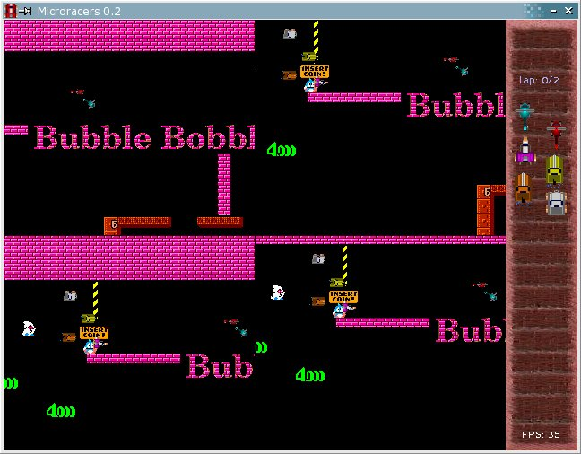

Microracers - README
--------------------

This is an old game I developed a long time ago. To try it, you need the packages libsdl1.2-dev, libsdl1.2-dev and libsdl-ttf2.0, then just type `make`.

This is the latest stable 0.2 version. There is an unstable 0.3 version that included a track editor, but I never finished that one. It is under the "unstable" folder. See [this repository](https://gitlab.com/osgames/microracers) if you want to get the full original CVS history.

----------------------------

http://microracers.sourceforge.net/

Version 0.2

November 2005

DESCRIPTION
-----------
  Microracers aims to be a 2D top-view car racing game.
  It is inspired on the old Micromachines game, but it isn't meant
to be a clone of it.

GAMEPLAY
--------
  For now, the game is just played as a race between six
players. Four of them can be human players, playing on the
same keyboard. Wins who completes two laps the first.
  Controls are listed on the main menu.

FEATURES
--------
  This version features:
  - terrain types and checkpoints;
  - simple artificial inteligence;
  - dynamic rotation and change of vehicles color;
  - easy configuration of vehicles and trakcs through files;
  - multiple vehicles and tracks to choose from;
  - decent menu.

CONTIBUTING
-----------
  We greatly appreciate feedback, so please send 'em all to:
microracers-devel@lists.sourceforge.net (EDIT: mailing list no longer working)
